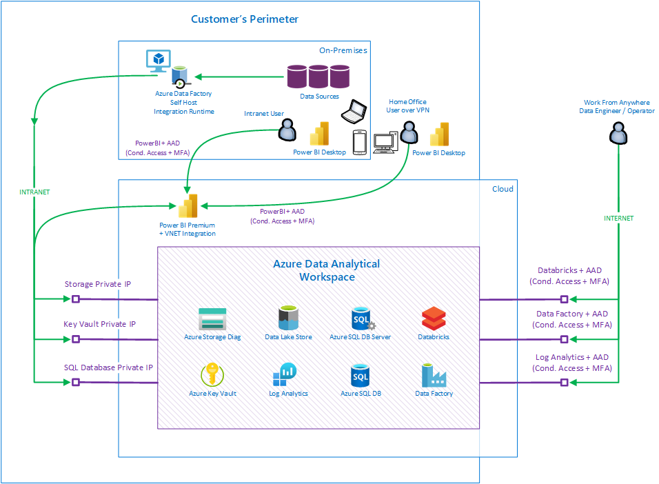

# Azure Data Analytical Workspace (ADAW) - Reference Architecture 2021 for Regulated Industries

## Project Overview

The goal of this project is to provide and document referential infrastructure architecture pattern,
guidance, explanations, and deployment resources/tools
to successfully deploy workspace for data analysis based on Azure services.

Focus is to provide the highest security level as this deployment pattern is
used in Highly Regulated Industries.

We are describing reusable pattern which can be further customized as each customer has different needs
and expectations. All resources are included inside this repository and we are open for feedback to further extend this pattern.

You can think about this guidance as Enterprise Ready plug-able
infrastructure building block for Data Analytics workloads compatible with Microsoft Best Practices for Landing Zones.

Data Analytical Workspace can be deployed multiple times in organization
for different teams, for different projects, for different environments (DEV, TEST, PROD, etc.).

Data Analytical Workspace can be deployed in automated way through provided scripts in cloud native way.
This provides consistent experience with focus on high quality security standards.
Approve once, deploy multiple times in the same secure way.

### Key Features

- Focus on Enterprise Grade Security standards
- Strong Support for Auditing, Monitoring and Diagnostics data
- Integrate and Keep network communication in perimeter where applicable
- Allow consumption of data sources inside perimeter, analyze data in cloud
- Benefit from Cloud Managed Services, reduce management and operations overhead
- Integrations with other cloud native tools - mainly Power Platform
- Protect and encrypt storage where potentially sensitive data are stored
- Protect keys and credentials in secure place

## Architecture Overview

Idea behind this pattern is based on following workflow.

Business Users needs to present, consume, slice and dice data in quick way on multiple devices from multiple places.
Ideally on data model which is optimized (transformed) for data domain they are aligned to.

To achieve this, you typically need to get data in scalable way from multiple data sources in raw format (typically sitting on-prem),
store them in scalable way with potentially huge volumes. Store them to cheap storage in multiple versions and with history, clean data,
combine data Together, pre-aggregate data and store them again in structured way with indexing capability to provide speed for access.
You probably also want to mask data and secure/hide data which should not be seen by users from other geo regions or departments.

For that, you need to understand (propagate security context) who is viewing the data from reporting tool to structured storage
and ensure you are filtering data for target user based on role. (Role Based Access Control, Row Level Security).
You do not want to do it manually, database engine should do it for you based on roles.

### Architecture in Azure components

Let's have a look how architecture described above can be translated into specific Azure services.


#### Key Components in the solution

- Azure Data Lake Storage
- Azure SQL Database
- Azure Databricks
- Azure Data Factory
- Azure Storage, Azure Key Vault and Azure Monitor + Log Analytics as tools for monitoring, security and audit
- Power BI Premium + VNET Integration - Optional
- Azure Data Factory Self HostIntegration Runtime - Optional
- Azure Machine Learning - Optional

_**Business Users needs to present, consume, slice and dice data in quick way on multiple devices from multiple places**_

This can be achieved by easy-to-use PowerBI reporting tool, which can be used from anywhere and on multiple platforms and devices.

PowerBI runs in cloud as managed service. Service can be also integrated with perimeter for access from devices and can also access
data sources which are part of perimeter (on-premises or in cloud via private link). This PowerBI Premium VNET integration feature is in preview now.

You do not want to use PowerBI gateway for perimeter access which is typically multiplexing accessing users to one service identity and thus undermining security context against target database which is important to preserve.

PowerBI also supports integration with Azure Active Directory (cloud identity) and advanced security features. Identity and whole
security context can be thus propagated through PowerBI to the database engine and database engine can use native filtering capabilities
based on role accessing user belongs to.

Example can be: user from mobile device outside perimeter needs to access predefined and optimized report which is accessing and rendering sensitive data from data source hosted inside a perimeter. User might be required to establish VPN connectivity first, will be prompted to authenticate to PowerBI, verified with MFA and PowerBI rendering engine will pass user's identity of accessing user to the target database hosted in the perimeter. Database can verify accessing user and understand user's role/security group. With that database engine can do
query/data filtering and show only data user was allowed to see.

_**Need to get data in scalable way from multiple data sources in raw format (typically sitting on-prem), store them in scalable way with huge volumes to cheap storage in multiple versions and with history**_

PowerBI ideally needs to consume optimized data models for specific data domain which improves user experience,
reduces waiting time and improves data model maintenance. Before that, you typically need to run some ETL process
which will first get data from multiple data sources from many places, in raw format (snapshots) and store them for further processing.

In this architecture load is mainly role of Azure Data Factory - Easy to use ETL tool along with Azure Storage in Azure Data Lake (Hierarchical namespace) mode.

Azure Data Factory managed PaaS service allows you to connect many data sources through massive list of ever-growing list of supported connectors.
Azure Data Factory has a workspace where ETL process can be designed and executed at scale. Workspace can be accessed from anywhere as access policy
allows and is specified by security administrators. Similar approach like accessing O365 workspace.

Azure Data Factory also understands and can store data in multiple file formats (standard or proprietary).
Azure Data Factory can access data and store them in scalable manner as snapshots to Azure Data Lake Storage.
Basically, get data in scalable way from anywhere and store them in raw format to Azure Data Lake Storage in versioned way so more
sophisticated data models can be built based on such data.

To access data sources from cloud you need to have some kind of gateway which will not require to punch hole into the enterprise firewall. This
is what Azure Data Factory Self Host Integration Runtime provides. This component needs to be installed in
the on-premises environment (physical or virtual machine) and needs to be allowed to open communication to the cloud. Azure Data Factory
then can consume data from allowed data sources inside organization and process them in cloud by specific associated and only allowed Azure Data Factory instance.

Azure Data Lake is very cheap, practically unlimited storage space where data can be stored in raw formats, in multiple versions (e.g daily snapshots)
and storage is providing very secure (Role Based Access Control) way to store data. This storage is also optimized for support
of massive parallel processing of data. To provide even better security story, Azure Data Lake Storage is part of perimeter without exposing any public endpoint.

Storage will not be accessed directly by PowerBI (although technically possible and supported). Storage is kind of staging area in this case.
PowerBI should work with more structured and optimized domain driven data source built from raw data from storage.

_**Store data in structured way with indexing capability to provide speed for access. Data model which is optimized (transformed) for data domain data are aligned to.**_

Once the data are snapshot and available in cheap storage in raw, versioned, and complete form, it's time to transform them to the most useful product.
As domain data model expectations changes during a time it's very useful to keep data in complete, raw form and with history.
This allows at any point in time to introduce new dimension or attribute to domain data model with projection to the history.

ADAW supports transformations of data in mainly two ways (Azure Data Factory and Azure Databricks).
Both very capable and scalable tools with rich transformational features and adapters.

Solution was designed for reading data from Azure Data Lake Storage through private endpoint (part of perimeter), cleaning/normalizing data at scale,
transforming at scale, aggregating/merging/combining data at scale and with cost control (Azure Data Factory and/or Azure Databricks - fast transformation with more horse power for higher cost vs slower transformation with less power for better price) and storing cleaned/transformed/aggregated and domain optimized data to highly structured database with indexed data and business/domain specific vocabulary (Azure SQL Database).

Azure Databricks should be deployed with Premium SKU to enable advanced security features like RBAC for Cluster, Jobs, Notebooks and Azure AD passthrough.
Also Azure Databricks Virtual Network integrated with data sources and perimeter and Firewall for egress control should be enabled.

Azure Data Factory and Azure Databricks Workspace (not data) can be accessed through public endpoint with Azure Active Directory Authentication and enabled conditional access.

Azure SQL Database in this solution is playing key role as data source consumed by PowerBI clients. Model is optimized for business domain, for PowerBI reports,
with right business terminology and attributes and security trimming done at the database engine level through native capabilities.
Also PowerBI is configured in the way to consume data over private endpoints from Azure SQL Database (point-to-point) and
ingest data from Azure Databricks / Azure Data Factory Self Host Integration Runtime to improve security posture.

_**Mask data and secure/hide data which should not be seen by users from other geo regions or departments.**_

Data stored in the business data domain database (here Azure SQL Database) will probably contain data across whole organization and with sensitive data.
It's important to allow access only to subset of data based on roles accessing user belongs to. Typically, data cross regions from different units
in different geo locations, etc.
It's not best approach to do such filtering manually in code (error prone) and also it is not desired to do it in reports itself.
Such filtering based on security context should be done purely on the database level and all other consuming tools (including reporting tools)
will receive already filtered data. Accessing tools should pass identity of viewing user - not service accounts.
This allows to stay compliant with different auditing and traceability requirements.

Fortunately, Azure SQL Database implements such native features on the database engine level (row-level security) which makes implementation of such security trimming and auditing easier.

This requires propagating security context from viewing user to the database level. PowerBI can understand a propagate security context (user cloud identity)
to the business data domain database and database is able to use such identity, authenticate, authorize and filter data for such user based on the identity or roles this user belongs to.

## Deployment

Deployment of Azure Data Analytical Workspace can be done through provided Azure Resource Manager [ADAW.bicep](DeploymentScripts/ADAW.bicep) file or via generated Azure Resource Manager Template file [ADAW.json](DeploymentScripts/ADAW.json) which itself is based on ARM Bicep file.

You can find those script files in [DeploymentScripts](DeploymentScripts) directory.

Deployment file will provision resources which are part of Azure Data Analytical Workspace which you can see in the high-level architecture diagram above.

Azure Data Factory Self Host Integration Runtime, MFA, Conditional Access, Power BI Premium and Virtual Network Integration for Power BI Premium are not part of this script as they are more external components and configurations.
More technical description of deployment options for resources and implementation details are described later.

### Deployment Example

```bash
az group create --name ADAW --location NorthEurope --tags Costcenter=ABC001 Owner='Bob' --subscription "Subscription001"

az deployment group create -n ADAW -g ADAW -f ADAW.bicep --parameters projectPrefix=proj01 securityOwnerAADLogin=adawAdmin@xyz.com securityOwnerAADId=00000000-0000-0000-0000-000000000000 securityAlertEmail=adawAdmin@xyz.com sqlServerLogin=myUserName sqlServerPassword=myPassword virtualApplianceIPAddress=192.168.0.4 --subscription "Subscription001"
```

### Deployment parameters

Following parameters can be / must be passed into template file to provision environment with specific values.

- ```projectPrefix``` - required - Prefix for a project resources.
Each provisioned resource will use this prefix. This is for sorting / searching resources mainly.

- ```securityOwnerAADLogin``` - required - Specifies the login ID (Login Name) of a user in the Azure Active Directory tenant.
Resources which support Azure Active Directory for Authentication (like Azure SQL Database) will use
such specified account and assign this account into Administrator role.
This account is ultimate owner of the solution with the highest permissions.

- ```securityOwnerAADId``` - required - Specifies the login ID (Object ID) of a user in the Azure Active Directory tenant.
This is ID of the user which must correspond to the parameter ```securityOwnerAADLogin```.
Resources which support Azure Active Directory for Authentication (like Azure Key Vault) will use
such specified ID and assign this account into Administrator role.
This account is ultimate owner of the solution with the highest permissions.

- ```securityAlertEmail``` - required - Specifies the customer's email address where any security findings will be sent for further review.
This is mainly for any potential and suspicious security issues which should be further investigated.
Based on Azure Alert Policies and Azure Vulnerability Assessments on Azure SQL Database.

- ```sqlServerLogin``` - required - Specifies the Administrator login for SQL Server.
Azure SQL Database requires SQL Database Authentication (Username and password) be specified even though
Azure Active Directory is enabled.
This will be changed in the future and only Azure Active Directory will be enabled for Authentication.

- ```sqlServerPassword``` - required - Specifies the Administrator password for SQL Server.
Azure SQL Database requires SQL Database Authentication (Username and password) be specified even though
Azure Active Directory is enabled.
This will be changed in the future and only Azure Active Directory will be enabled for Authentication.

- ```location``` - optional - Target region/location for deployment of resources. Default value is taken from the target resource group location.

- ```resourceTags``` - optional - Tags to be associated with deployed resources. Default tags are taken from the target resource group.

- ```vNetPrefix``` - optional - This is virtual network address space range for the solution. Default value is 10.0.0.0/16.
If this VNET needs to be peered and/or routed through Enterprise Firewall, make sure the address space is not in the collision with
existing networks or provide other non-collision value. This VNET hosts at least three subnets. Should not be smaller than /24 and each subnet at least /26.

- ```subnetControlPlanePrefix``` - optional - This is subnet range from virtual network address space above
for Azure Databricks control plane component. Default value is 10.0.0.0/20. Should not be smaller than /26.

- ```subnetDataPlanePrefix``` - optional - This is subnet range from virtual network address space above
for Azure Databricks data plane component. Default value is 10.0.16.0/20. Should not be smaller than /26.

- ```subnetPrivateLinkPrefix``` - optional - This is subnet range from virtual network address space above
for hosting private link resources. Default value is 10.0.32.0/23. Should not be smaller than /26.

- ```logRetentionInDays``` - optional - This value specifies for how long diagnostics, audit, security logs for Azure resources
should be kept in Log Analytics Workspace. Long retention period can have cost impact. Default value is 120 days.

- ```securityEmailAdmins``` - optional - Specifies if the security alert / security findings will be sent to the
Azure subscription administrators in an addition to the email in ```securityAlertEmail``` parameter. Default value is false.

- ```sqlServerDBSkuName``` - optional - Specifies the SKU for Azure SQL Database. Typically, a letter + Number code. S0 - S12, P1 - P15. Default value is S0.

- ```sqlServerDBTierName``` - optional - Specifies the tier or edition for Azure SQL Database. Basic, Standard, Premium. Default value is Standard.

- ```virtualApplianceIPAddress``` - optional - Specifies the IP Address of Virtual Network Appliance (Firewall) into which traffic from the Virtual Network will be routed to. Default value is empty (no routing).
Virtual Network from the parameter ```vNetPrefix``` needs to be peered / connected with virtual network where Virtual Network Appliance (Firewall) is hosted.

## Implementation Details

Following is a description of settings for each resource of the solution. This should provide information about
why values are set in the way they are set, what is the idea behind, security level, limitations etc.

Generally, each resource which supports diagnostics logs will redirect all those logs into Log Analytics Workspace
to provide monitoring, and security auditing.

Private link feature for resources is leveraged as much as possible, unless some functionality would be limited.
In such case this is mentioned and documented.

All non-global resources are created in the region specified in the input template parameter ```location```.

All resources which can be tagged, are tagged explicitly with values coming from input template parameter ```resourceTags```.

### Private Link Zones

Following private link zones are created. These zones enables private link feature for Azure storage, Azure Key Vault, Azure SQL Database, etc.
Zones are linked with provisioned virtual network to provide DNS resolution for private link feature inside virtual network.

- privatelink.blob.core.windows.net
- privatelink.dfs.core.windows.net
- privatelink.vaultcore.azure.net
- privatelink.database.windows.net

### Log Analytics

Log Analytics is used in this solution as monitoring and diagnostics tool. All logs from all resources which can produce logs
and can be redirected to Log Analytics are redirect into Log Analytics for storage with given retention period (input parameter ```logRetentionInDays```).

Log Analytics is exposed over public endpoint to allow troubleshooting even in cases perimeter or virtual network doesn't work.
Log Analytics workspace is protected and can be accessed only via Azure Active Directory.

Pricing model is based on price per GB.
No capacity reservation level is enabled for this workspace.
No daily quota ingestion capping is enabled.
Query and ingestion over public network is Disabled.

Diagnostic Settings of Log Analytics is redirected into Log Analytics itself with retention period ```logRetentionInDays```.

### Networking

Solution creates and uses Azure Virtual Network to host some Azure services.
This allows to integrate and protect Azure resources as part of the perimeter via private link feature.

Azure Virtual Network consist of following subnets:

- control-plane
- data-plane
- private-link

Also communication of Azure Services can be routed (when needed) through Central Network Virtual Appliance.
For this, you need to specify parameter ```virtualApplianceIPAddress``` which will configure route table on
subnets to redirect ```'0.0.0.0/0'``` traffic to the Network Virtual Appliance listening on the IP Address ```virtualApplianceIPAddress```.
Obviously, you need to also create network peering with Virtual Network where your Network Virtual Appliance is located.
Creating network peering is manual step on your side and is not part of this script.

Azure DDoS Protection is currently disabled by default on Virtual Network level.
Variable ```useDdosProtectionPlan``` can be changed to value ```true``` to enable Azure DDoS Protection.

VM protection is enabled for all the subnets in the virtual network.

Each subnet of Azure Virtual Network has associated network security group and diagnostic settings of network security group.

#### control-plane subnet and network security group

This subnet is for integrating with Azure Databricks control plane.

This script creates two rules in network security group for this subnet.

- Deny all incoming communication
- Deny all outgoing communication.

Databricks itself modifies this network security group to additionally add any incoming communication from whole virtual network,
allows outgoing communication to whole virtual network, outgoing Azure Databricks (port 443), outgoing Azure MySQL DB (port 3306),
outgoing Azure Storage (port 443) and outgoing Azure Event Hub (port 9093).

Diagnostic settings of network security group is redirected into Log Analytics.

#### data-plane subnet and network security group

This subnet is for hosting data nodes which are part of Azure Databricks clusters.

This script creates four rules in network security group for this subnet.

- Deny all incoming communication.
- Allow outgoing communication to port 433 to private link subnet, so data nodes can consume Azure Services attached via private link feature.
- Allow outgoing communication to port 1433 to private link subnet, so data nodes can consume Azure SQL Database attached via private link feature.
- Deny all the other outgoing communication.

Databricks itself modifies this network security group to additionally add any incoming communication from whole virtual network,
allows outgoing communication to whole virtual network, outgoing Azure Databricks (port 443), outgoing Azure MySQL DB (port 3306),
outgoing Azure Storage (port 443) and outgoing Azure Event Hub (port 9093).

Diagnostic settings of network security group is redirected into Log Analytics.

#### private-link subnet and network security group

This subnet is for hosting private link resources which are part of the solution.
Out of the box it is Azure Data Lake Store, Azure SQL Database and Azure Key Vault. More can be added.

This script creates four rules in network security group for this subnet.

- Allow incoming communication to port 433 from data-plane subnet, so data nodes can consume Azure Services attached via private link feature.
- Allow incoming communication to port 1433 from data-plane subnet, so data nodes can consume Azure SQL Database attached via private link feature.
- Deny all the other incoming communication.
- Deny all outgoing communication.

This network security group is not modified by Azure Databricks.
Diagnostic settings of network security group is redirected into Log Analytics.
